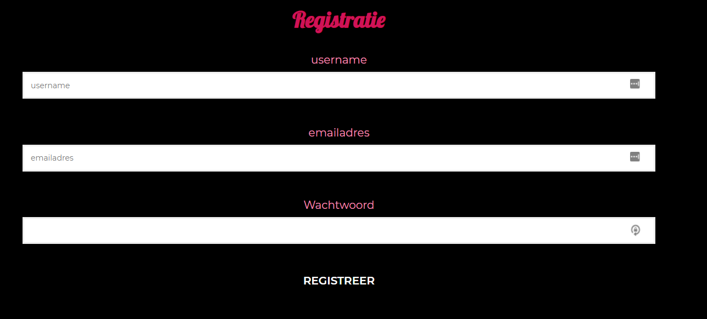
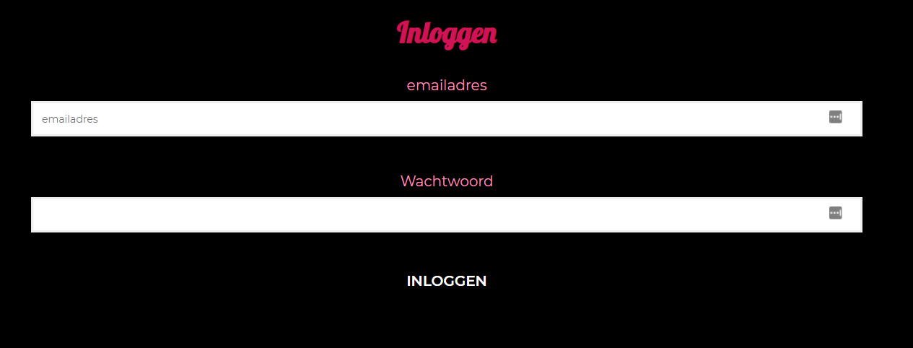

# Project Tech

## Mijn feature

Gebruiker kan via een form zich zelf registreren binnen de dating app. In deze form kan de gebruiker een username , emailadres en password invoeren. Deze data wordt opgeslagen in een database. Wanneer de gebruiker is geregisteerd kan hij/zij inloggen met het emailadres en wachtwoord.

## Use

1. Clone de applicatie

`git clone https://github.com/SBindels/tech`

2. Navigeer naar de project map

`cd tech`

3. Plaats de `.env` file in de map

4. Installeer packages

`npm install`

5. Start de applicatie

`npm start`

## Documentatie

Alle documentatie kan je vinden in mijn [tech wiki](https://github.com/SBindels/tech/wiki)

## Auteur

- Sjoerd Bindels

## Licentie

Project is gelicenseerd met een MIT License, (zie LICENSE)
